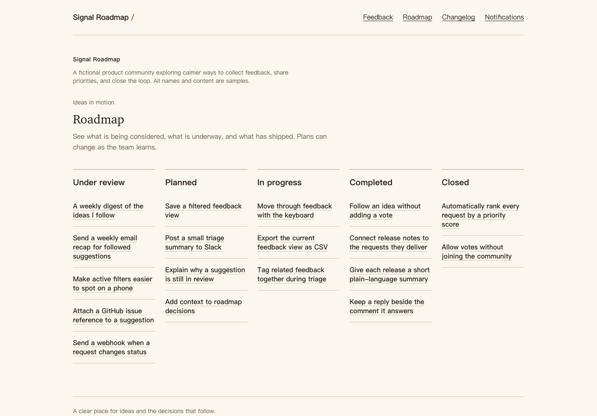

# Signal Roadmap

A feedback portal connecting suggestions, decisions, and shipped changes.
Members share ideas, vote and discuss. Moderators review submissions, combine
duplicates, update the roadmap, and publish releases that notify followers.

An independently authored portfolio app using Next.js, React, TypeScript and
PostgreSQL. Public deployment is pending.



[Mobile feedback screenshot](docs/feedback-mobile.png). Captured from the running
local app with original fictional data, not a hosted deployment.

## Try the workflow

Start a private demo on the home page; no account or email is needed. Open the
board, submit an idea, vote and comment. Choose **Try moderator view** to approve
the submission, merge the seeded duplicate pair, change a status, or publish a
release. Return to member to inspect notifications.

Each demo has isolated data and expires after 24 hours. It cannot change the
public showcase or another visitor's workspace. Starting another demo replaces
the browser's previous demo credential. Demo data is temporary, not a backup.

## Features

- Search, board/tag filters, moderation and five roadmap states.
- Persistent votes, threaded comments, follows and in-app notifications.
- Transactional merging with deduplicated voters/followers, attributable
  read-only discussion history and old-link redirects.
- Public roadmap and changelog linked to completed ideas.
- Owner branding/member controls and moderator board/tag administration.
- Email-link sign-in, scoped roles, isolated demos and request quotas.
- Responsive layouts, keyboard controls, axe checks, nonce CSP and safe errors.

Real local PostgreSQL backs the browser acceptance journey. Hosted deployment,
live SMTP/Redis and production smoke checks remain release gates. Optional R2
uploads must stay disabled until retention and live CORS are verified.

## Local setup

Use Node **24**, pnpm **11.19.0**, PostgreSQL **17** and Google Chrome.
Docker Compose can provide two isolated local databases.

```sh
pnpm install --frozen-lockfile
cp .env.example .env.local
```

Replace every placeholder in `.env.local`. Choose a local-only database password,
URL-encode it in both URLs, and generate three independent secrets of at least
32 characters. Generate each secret locally:

```sh
node -e "console.log(require('node:crypto').randomBytes(32).toString('hex'))"
```

Never share these values or commit the file.

```sh
docker compose --env-file .env.local up -d --wait
pnpm db:migrate
pnpm db:seed
pnpm dev --hostname 127.0.0.1 --port 3000
```

Open the exact `APP_URL` origin (example: `http://localhost:3000`). Visit `/`
for a private demo or `/signal-roadmap/feedback` for the showcase. Do not open
source HTML directly: this app requires its running server and database.

Without Docker, install PostgreSQL 17 and create `signal` and a **separate**
`signal_test` database on loopback, then update both URLs. Never test against
production. The development workstation uses native clusters; Docker commands
need a Docker-equipped host. The optional `scripts/local-database.mjs` helper
expects binaries already in `.local/postgres`; it is not an installer.

Reset/test launchers require explicit loopback application and test URLs without
query parameters. Unset inherited `PGHOST`, `PGHOSTADDR`, `PGPORT`, `PGDATABASE`
and `PGSERVICE` overrides first; ambiguous connections are refused.

### Environment

See [.env.example](.env.example) for the template.

| Variable                                                                 | Purpose                                                                   |
| ------------------------------------------------------------------------ | ------------------------------------------------------------------------- |
| `DATABASE_URL`                                                           | App PostgreSQL connection; TLS when hosted                                |
| `TEST_DATABASE_URL`                                                      | Separate loopback `_test` database, no URL parameters; omit in production |
| `APP_URL`                                                                | Canonical origin; HTTPS in production, no path/credentials                |
| `AUTH_SECRET`, `DEMO_COOKIE_SECRET`, `CRON_SECRET`                       | Independent random secrets                                                |
| `EMAIL_SERVER`, `EMAIL_FROM`                                             | SMTP(S) URL and plain sender email; required in production                |
| `UPSTASH_REDIS_REST_URL`, `UPSTASH_REDIS_REST_TOKEN`                     | Required for production request handling                                  |
| `R2_ACCOUNT_ID`, `R2_ACCESS_KEY_ID`, `R2_SECRET_ACCESS_KEY`, `R2_BUCKET` | Optional all-or-none storage; leave blank initially                       |
| `LOCAL_POSTGRES_PASSWORD`                                                | Docker Compose only                                                       |

Development without SMTP prints short-lived sign-in links in the local server
terminal. Never expose these logs. Production has no such fallback and denies
requests if Redis is absent/unavailable.

## Verification and data

```sh
pnpm format:check
pnpm lint
pnpm exec next typegen
pnpm typecheck
pnpm test:coverage
pnpm build --webpack
pnpm e2e
```

Browser tests use port 3200, an isolated `.next-e2e` build and the validated
test database, which they reset. Chrome runs locally, Chromium in CI. Failure
traces/screenshots stay in ignored `test-results/`. Do not run database/browser
suites concurrently. Unit coverage does not load `.env.local`.

Run real database suites **sequentially**:

```sh
pnpm test:db
FEEDBACK_DATABASE_TEST=1 node --env-file-if-exists=.env.local node_modules/vitest/vitest.mjs run src/test/feedback-database.test.ts
ENGAGEMENT_DATABASE_TEST=1 node --env-file-if-exists=.env.local node_modules/vitest/vitest.mjs run src/test/engagement-database.test.ts
MODERATION_DATABASE_TEST=1 node --env-file-if-exists=.env.local node_modules/vitest/vitest.mjs run src/test/moderation-database.test.ts
ROADMAP_DATABASE_TEST=1 node --env-file-if-exists=.env.local node_modules/vitest/vitest.mjs run src/test/roadmap-database.test.ts
CHANGELOG_NOTIFICATION_DATABASE_TEST=1 node --env-file-if-exists=.env.local node_modules/vitest/vitest.mjs run src/test/changelog-notifications.test.ts
SETTINGS_DATABASE_TEST=1 node --env-file-if-exists=.env.local node_modules/vitest/vitest.mjs run src/test/settings-database.test.ts
DEMO_FIXTURES_DATABASE_TEST=1 node --env-file-if-exists=.env.local node_modules/vitest/vitest.mjs run src/test/demo-fixtures-database.test.ts
```

Foundation tests require a test URL and clear its application tables.

```sh
pnpm db:generate   # Generate SQL after deliberate schema changes
pnpm db:migrate    # Apply committed migrations to DATABASE_URL
pnpm db:seed       # Idempotently create the fictional showcase
pnpm demo:cleanup  # Delete at most 100 expired demos
pnpm demo:reset    # DESTRUCTIVE: reset marked canonical showcase only
```

Seed: 3 boards, 6 tags, 18 published and 3 pending ideas, 24 comments, 3 releases.
Reset refuses unmarked/colliding workspaces; do not reset data you want to keep.

## Architecture, deployment and privacy

Next.js routes → authorization/services → scoped Drizzle repositories → PostgreSQL.
Adapters handle SMTP, Redis and optional R2.

- [Architecture](docs/architecture.md): roles, transactions and isolation.
- [Deployment](docs/deployment.md): setup, cleanup and production smoke checks.
- [Privacy](docs/privacy.md): stored data, cookies, retention and limits.

This server-backed app cannot run on static GitHub Pages. Initial hosting targets
Vercel, Neon and Upstash. Daily cleanup is configured; verify actual provider
eligibility/quotas before launch. Never automatically enable a paid plan.

## Scope and acknowledgements

Phase one excludes billing, enterprise SSO, arbitrary webhooks, product-event
email, self-service workspace creation, account export and account deletion.
Sign-in does not automatically grant membership/owner access. The demo provides
member and moderator personas, never owner.

Application code and fictional copy were independently written; no upstream
application source or marketing copy was imported. Framework scaffolding and
dependencies retain their own licenses. Built with Next.js, React, TypeScript,
Drizzle, PostgreSQL, Auth.js, Tailwind CSS, Zod, Vitest, Playwright, axe-core,
AWS SDK and Upstash. Preserve dependency notices when redistributing.

Application license: [MIT](LICENSE), copyright 2026 z15007129953-code.
